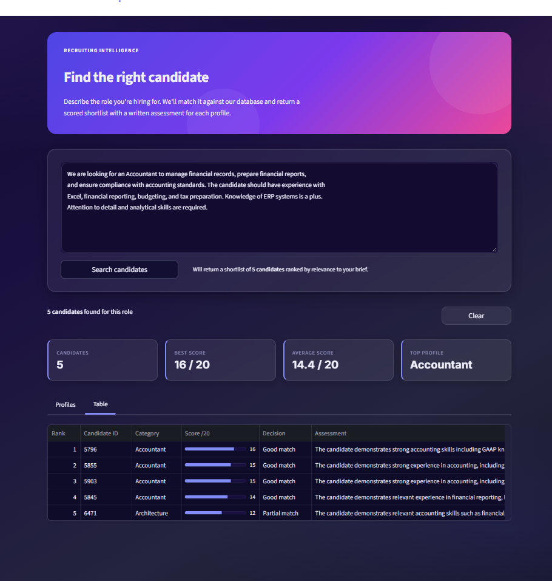
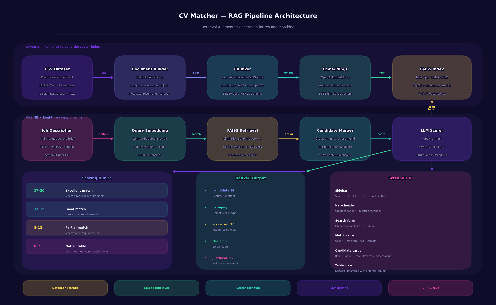

<div align="center">

# CV Matcher

**AI-powered resume matching engine built on a RAG pipeline.**
Paste a job description. Get a ranked, scored, and explained candidate shortlist in seconds.


</div>

---

## Preview



---

## Architecture



> **Offline (top row):** build the FAISS index once from the CV corpus.
> **Online (bottom row):** embed the query, retrieve candidates, score with LLM, display results.

---

## Table of Contents

- [Overview](#overview)
- [Tech Stack](#tech-stack)
- [Project Structure](#project-structure)
- [Dataset](#dataset)
- [Pipeline](#pipeline)
  - [1. Data Loading](#1-data-loading)
  - [2. Document Building](#2-document-building)
  - [3. Chunking](#3-chunking)
  - [4. Vector Indexing](#4-vector-indexing)
  - [5. Semantic Retrieval](#5-semantic-retrieval)
  - [6. LLM Scoring](#6-llm-scoring)
- [Scoring Rubric](#scoring-rubric)
- [Streamlit UI](#streamlit-ui)
- [Setup](#setup)
- [Usage](#usage)
- [Design Decisions](#design-decisions)

---

## Overview

**CV Matcher** is a production-ready RAG pipeline for recruiting teams. Given a plain-language role description, it:

1. Embeds the query with `text-embedding-3-small` and searches a FAISS index of 67,101 CV chunks
2. Groups the top-K results by candidate and merges their text
3. Scores each profile with `gpt-4.1-mini` using a strict rubric — returning a score /20, a decision label, and a written justification
4. Displays the ranked shortlist in a dark-themed Streamlit dashboard

The output is **explainable**, **deterministic** (`temperature=0`, `seed=42`), and **consistent** across identical queries.

---

## Tech Stack

| Layer | Technology | Role |
|:---|:---|:---|
| Language | Python 3.11+ | Runtime |
| Orchestration | LangChain 0.3 | Document pipeline, LLM calls |
| Embeddings | `text-embedding-3-small` | 1,536-dim query & document vectors |
| Vector store | FAISS `faiss-cpu` 1.9 | Offline index + similarity search |
| LLM judge | `gpt-4.1-mini` | Structured scoring of candidates |
| UI | Streamlit 1.55 | Recruiting dashboard |
| Data | pandas · numpy | Dataset loading and manipulation |
| Config | python-dotenv · pydantic | Environment and validation |

---

## Project Structure

```
CV_Matching/
│
├── streamlit_app.py            # Streamlit UI — main entry point
├── config.py                   # Paths, model names, chunking params
├── main.py                     # CLI entry point
├── requirements.txt
├── generate_architecture.py    # Script to regenerate the architecture diagram
│
├── .streamlit/
│   └── config.toml             # Dark theme configuration
│
├── src/
│   ├── load_data.py            # CSV → pandas DataFrame
│   ├── build_documents.py      # DataFrame → LangChain Documents + chunking
│   ├── build_index.py          # Full offline indexing pipeline (run once)
│   ├── retrieve.py             # FAISS similarity search
│   ├── rank_with_llm.py        # LLM scoring and result ranking
│   ├── app.py                  # CLI orchestrator
│   ├── chunking/
│   ├── ingestion/
│   ├── ranking/
│   ├── retrieval/
│   └── vectorstore/
│
├── docs/
│   ├── architecture.png        # Pipeline architecture diagram
│   └── UIstreamlit_.PNG        # Streamlit UI screenshot
│
├── data/
│   └── processed/
│       └── Preprocessed_Data.txt   # CV corpus (not versioned)
│
└── tests/
    └── test_retrieval.py
```

---

## Dataset

| Metric | Value |
|:---|:---|
| Total CVs | 13,389 |
| Professional categories | 43 |
| Avg CV length | ~3,986 characters |
| Chunks after splitting | 67,101 |
| Avg chunk size | ~1,000 chars / ~250 tokens |
| Missing values | 0 |

**Domains covered:** Data Science, HR, Software Development, Finance, Civil Engineering, Blockchain, Aviation, Marketing, Healthcare, Legal, and 33 others.

The source file (`Preprocessed_Data.txt`) is a CSV with two columns — `Category` and `Text`. It is excluded from version control due to its size.

---

## Pipeline

### 1. Data Loading

**`src/load_data.py`**

The CSV is loaded with pandas. The path is resolved relative to the script using `Path(__file__).resolve().parent.parent`, so it works regardless of the working directory.

```python
df = pd.read_csv(DATA_PATH, dtype=str).dropna(subset=["Text"])
# 13,389 rows × 2 columns
```

---

### 2. Document Building

**`src/build_documents.py`**

Each row becomes a LangChain `Document`. Metadata is preserved through all downstream steps.

```python
Document(
    page_content=row["Text"],
    metadata={
        "resume_id": idx,
        "category":  row["Category"],
    }
)
```

---

### 3. Chunking

**`src/build_documents.py` → `split_documents()`**

Parameters were chosen based on dataset statistics — average CV length ~3,986 chars, target of 3–5 chunks per document.

| Parameter | Value | Rationale |
|:---|:---|:---|
| `chunk_size` | 1,000 chars | ≈ 250 tokens — optimal for `text-embedding-3-small` |
| `chunk_overlap` | 150 chars | 15% overlap — preserves cross-boundary context |
| Splitter | `RecursiveCharacterTextSplitter` | Splits on `\n\n`, `\n`, `. `, ` ` before hard-cutting |

**Result: 13,389 documents → 67,101 chunks** (ratio ≈ 5.0×)

---

### 4. Vector Indexing

**`src/build_index.py`** — run once, re-run only if the dataset changes.

```
[1/4] Load dataset      →  13,389 CVs
[2/4] Build documents   →  13,389 LangChain Documents
[3/4] Chunk             →  67,101 chunks
[4/4] Embed + Index     →  FAISS saved to disk
```

Embedding model: `text-embedding-3-small` — best quality/cost ratio at 67k vectors (full index build < $1).

```bash
python src/build_index.py
```

---

### 5. Semantic Retrieval

**`src/retrieve.py`**

The job description is embedded at query time and compared against all 67,101 vectors via cosine similarity.

```python
vectorstore = FAISS.load_local(FAISS_INDEX_PATH, embeddings)
chunks = vectorstore.similarity_search(query, k=K)
```

Top-K chunks are then **grouped by `resume_id`** — multiple chunks from the same CV are merged into one candidate entry, and sorted deterministically before scoring.

---

### 6. LLM Scoring

**`src/rank_with_llm.py`**

Each candidate is evaluated by `gpt-4.1-mini` with `temperature=0` and `seed=42` for full reproducibility. The model returns a structured JSON object:

```json
{
  "candidate_id": 1042,
  "category": "Data Science",
  "score_sur_20": 17,
  "decision": "Excellent match",
  "justification": "Strong Python, SQL, and NLP background with proven production ML experience..."
}
```

A markdown-stripping fallback cleans up the rare case where the model wraps output in a code block. Results are sorted descending by `score_sur_20`.

---

## Scoring Rubric

Injected into every prompt to enforce consistency and prevent score hallucination.

| Score | Decision | Criteria |
|:---|:---|:---|
| **17 – 20** | Excellent match | Meets almost all requirements. Strong skills, relevant experience, right domain. |
| **13 – 16** | Good match | Meets most requirements. Minor gaps on secondary skills or seniority. |
| **8 – 12** | Partial match | Meets some requirements. Noticeable gaps on key skills or domain fit. |
| **0 – 7** | Not suitable | Does not meet core requirements. Wrong domain or missing critical skills. |

Strict rules enforced in the prompt:
- Score above 16 only if the candidate clearly meets **all** major requirements
- Score below 8 only if the candidate is clearly in the wrong domain
- Decision label must exactly match the score band — no exceptions
- Two similar CVs for the same job must receive similar scores

---

## Streamlit UI

**`streamlit_app.py`** — dark-themed single-mode recruiting dashboard.

**Sidebar**
- Shortlist size slider (1 – 10 candidates)
- 10 preset role examples (Data Scientist, DevOps, HR Recruiter, Finance Analyst…)
- Numbered recent search history

**Main area**
- Gradient hero banner (indigo → violet → pink)
- Job description textarea + submit
- 4 summary metrics: profiles scored · best score · average · top domain
- **Candidate cards** tab: rank pill · decision badge · score /20 · progress bar · written assessment
- **Table view** tab: sortable dataframe with visual progress column

**Theme:** Deep space background (`#0F0C29 → #1a1040`) · glassmorphism cards · indigo accent `#818CF8` · Inter font.

```bash
streamlit run streamlit_app.py
# Opens at http://localhost:8501
```

---

## Setup

### Prerequisites

- Python 3.11+
- OpenAI API key
- Dataset file `Preprocessed_Data.txt` (not versioned)

### Step-by-step

```bash
# 1. Clone
git clone https://github.com/Esperant242/CV_Matching.git
cd CV_Matching

# 2. Virtual environment
python -m venv .venv
.venv\Scripts\activate        # Windows
# source .venv/bin/activate   # macOS / Linux

# 3. Dependencies
pip install -r requirements.txt

# 4. API key — create a .env file
echo OPENAI_API_KEY=sk-proj-... > .env

# 5. Place the dataset
# → data/processed/Preprocessed_Data.txt

# 6. Build the vector index (run once — takes a few minutes)
python src/build_index.py

# 7. Launch
streamlit run streamlit_app.py
```

---

## Usage

### Streamlit UI

```bash
streamlit run streamlit_app.py
```

Open `http://localhost:8501`, describe the role, set shortlist size, click **Search candidates**.

### CLI

```bash
python src/app.py --query "Senior Python Developer with FastAPI and AWS" --k 5
```

### Python API

```python
# Retrieval only
from src.retrieve import retrieve_top_matches

docs = retrieve_top_matches("Data scientist with NLP expertise", k=5)
for doc in docs:
    print(doc.metadata, doc.page_content[:200])
```

```python
# Full pipeline
from src.rank_with_llm import rank_candidates_with_llm

results = rank_candidates_with_llm(
    job_description="DevOps engineer with Kubernetes, Terraform and AWS...",
    k=5,
)

for r in results:
    print(f"#{r['candidate_id']}  {r['category']}  {r['score_sur_20']}/20  {r['decision']}")
    print(f"   {r['justification']}\n")
```

---

## Design Decisions

**FAISS over a managed vector DB**
At ~70k vectors, `faiss-cpu` is fast enough locally with zero infrastructure overhead. Index loads in under a second at query time.

**`text-embedding-3-small`**
Best quality/cost ratio at scale. Embedding the full 67k-chunk corpus costs under $1.

**`gpt-4.1-mini` for scoring**
Instruction-following enough to respect a strict JSON schema and scoring rubric consistently. More powerful models would be overkill for structured extraction from a focused prompt.

**`temperature=0` + `seed=42`**
Fully deterministic: the same job description returns the same ranking every time. Without this, model non-determinism silently changes candidate order between runs.

**`chunk_size=1000`**
~250 tokens — meaningful enough to embed a full section of a CV rather than a few sentences, without exceeding the embedding context window.

**Merge chunks before scoring**
Retrieval returns chunks, not full CVs. Merging all chunks belonging to the same `resume_id` gives the LLM a complete picture of each candidate, reducing false negatives from CVs that are split across a section boundary.

---

## License

[MIT](LICENSE) — free to use, fork, and adapt.
